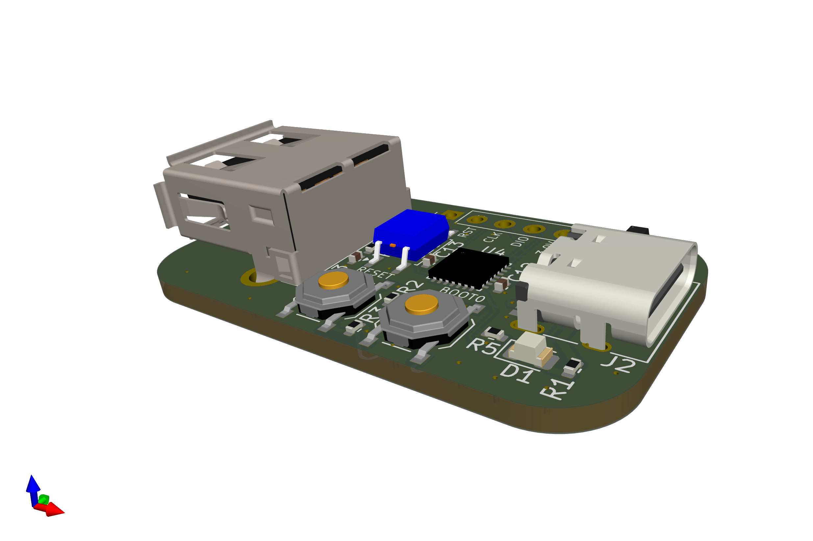

# Soundoff

Turn off power to the USB-A port when the connected host is in suspend.

This device is designed to be built with the cheapest process at JLCPCB.

It requires [firmware to be loaded](https://github.com/xobs/soundoff-firmware).