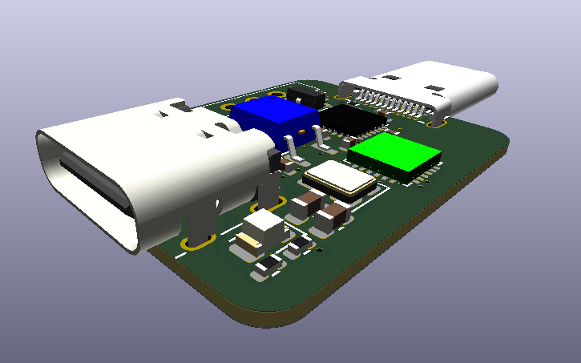

# Soundoff

Turn off power and data to the USB-C port when the connected host is in suspend.

This device is designed to be built with the cheapest process at JLCPCB.

It requires [firmware to be loaded](https://github.com/xobs/soundoff-firmware).
